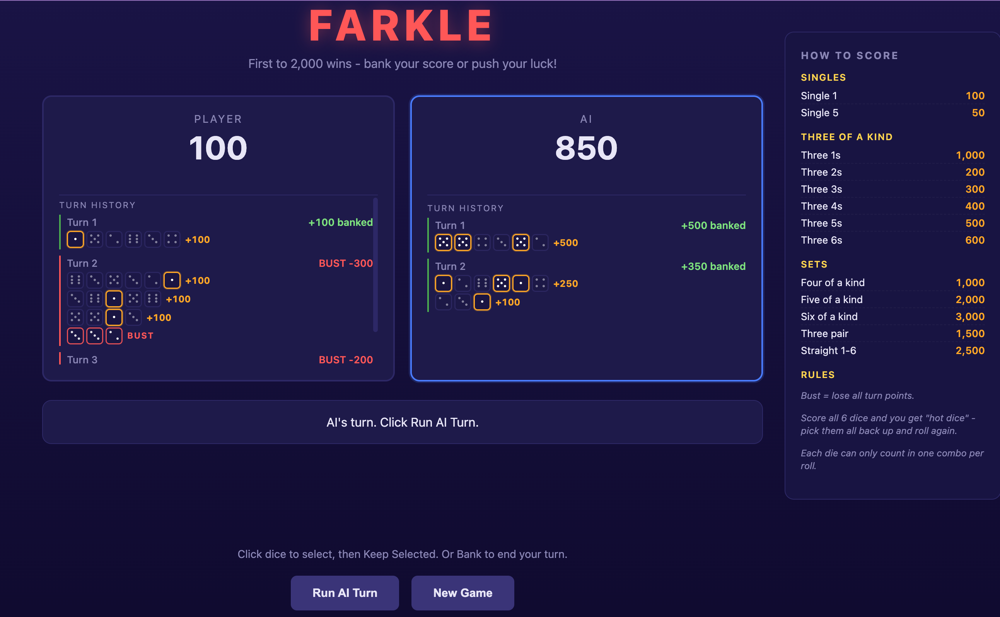

# Farkle - Group 3

A playable web-based Farkle game. First to **2,000** points wins - bank your
score or push your luck.



## Features

- 6 dice, standard push / bank / bust mechanics, hot-dice on all-six-scored.
- Clickable pip-style dice with orange selection glow.
- Animated rolls: dice tumble for ~700ms before settling on the server result.
- Simple AI opponent that picks the highest-scoring combo per roll.
- Per-player turn history with per-hold breakdown rendered as mini pip-dice
  (kept dice highlighted, unkept dimmed, bust holds red) so you can see
  exactly what scored.
- Sticky scoring reference sidebar.

## Run it

```bash
cd group-3
pip install -r requirements.txt
uvicorn app:app --reload
# open http://localhost:8000/
```

Run the scoring unit tests:

```bash
cd group-3
python3 -m unittest test_scoring.py
```

## Files

| File | Purpose |
|---|---|
| `app.py` | FastAPI app: JSON endpoints + serves the SPA. |
| `game.py` | `FarkleGame` state machine (turn flow, history, AI). |
| `scoring.py` | Pure scoring functions (singles, of-a-kind, straight, pair). |
| `test_scoring.py` | Unit tests for the scoring engine. |
| `ui.py` | Original terminal UI (kept for reference / CI). |
| `static/index.html` | Entire frontend in one file (HTML + CSS + JS, no build). |
| `requirements.txt` | `fastapi`, `uvicorn`, `pydantic`. |
| `PROMPTS.md` | The ten prompts that produced this code and the pitfalls hit along the way. |

## Architecture

- **Pure scoring** - `scoring.py` is stateless functions so the rules can be
  unit-tested in isolation.
- **State machine** - `game.py` owns all mutable game state; the API layer
  doesn't touch internals directly except via methods like `record_hold`,
  `bank`, `check_bust`.
- **Thin API** - `app.py` is a small FastAPI layer with one module-level
  `FarkleGame` instance. Endpoints return the full game state so the
  frontend can render without extra round-trips.
- **Frontend in one file** - `static/index.html` has no build step; it uses
  the JSON API via `fetch()` and `Promise.all`s the roll animation with
  the server call so the UI never blocks.

---

# Prompts Used

This Farkle implementation was built iteratively in **Cursor Agent mode**.
Each section below is a user prompt, paraphrased or quoted, followed by
what the agent did in response. The point of this section is to show how
the game evolved through conversation rather than a single spec - each
prompt is short and the agent handles planning, file layout, code
writing, and iteration.

---

## 1. Initial build

> Build a playable Farkle in Python. 6 dice, standard push / bank / bust
> mechanics, first to **2,000** points wins. Fetch the scoring rules from
> `https://github.com/nickmccollum/hackathon1/` before writing the scoring
> logic. Recommended enhancements: decoupled architecture (so the UI can
> be swapped later) and ASCII-art dice.

Agent fetched `farkle-rules.md` from the hackathon repo, then created:

- `scoring.py` - pure functions for `calculate_score`, `has_scoring_dice`.
- `game.py` - `FarkleGame` state machine with roll / keep / bank / bust
  / hot-dice and a simple AI opponent.
- `ui.py` - terminal loop with ASCII dice.
- `test_scoring.py` - unit tests across singles, 3/4/5/6 of a kind,
  three-pair, straight, and bust detection.

---

## 2. Migrate to a web UI

> Let's transfer to a FastUI / React-style web frontend with clickable
> dice selection.

First pass used [FastUI](https://github.com/pydantic/FastUI). The agent
later replaced it once the styling target became specific.

---

## 3. Scoring reference page

> A scoring reference is also needed on a page.

Added a `/rules` page with the full scoring table.

---

## 4. Match a target aesthetic

A screenshot was attached showing deep-navy/violet theme, red "FARKLE"
title, outlined score cards with an active-player glow, pip-style dice
that highlight in orange when selected, and an inline scoring card.

> I want to match this aesthetic with selectable dice.

Agent replaced FastUI with a hand-written single-page frontend served
from FastAPI:

- JSON API: `/api/state`, `/api/roll`, `/api/keep`, `/api/bank`,
  `/api/ai_step`, `/api/reset`.
- Dice are clickable, with selection tracked **by index** so duplicate
  faces stay independently selectable.
- Custom CSS approximates the screenshot (gradient background, red
  glow title, blue active-player border, orange selection glow).

---

## 5. Turn history

> Would it add value to show turn history on the left for player and right
> for AI?

Agent offered two options (outer sidebars vs inline in each score card).
User picked **option 2** - compact scrollable turn lists **below each
score**. Color-coded left border (green banked, red bust) and turn
numbering.

---

## 6. Scoring reference as a sidebar

> How one should/could score should be a sidebar.

Lifted the inline scoring card into a sticky right-hand sidebar with
sectioned lists (Singles, Three of a Kind, Sets, Rules).

---

## 7. Richer turn history

> Turn history needs to convey details on how scoring occurred from either
> opponent, it's better to understand how one is losing or winning.

Each turn entry expanded to include the per-hold breakdown: the roll,
the dice kept, and the points earned. Backend now records a `holds`
list on every bank / bust history entry.

---

## 8. Graphical dice in history

> +1 idea: show the dice graphically in the history, same style as the
> playing dice.

Replaced text-based roll listings with mini pip-dice. Kept dice render
with the orange glow matching the selection style; unkept dice are
dimmed; bust holds render with a red border and a `BUST` label.

---

## 9. Push-your-luck bug

> We should be able to re-roll the unselected dice.

The `/api/keep` endpoint was leaving unselected dice in `current_roll`,
which kept the Roll button disabled - trapping the player between Keep
and Bank with no way to push their luck. Fix:

- Clear `current_roll` after a successful keep; `dice_count` already
  tracks remaining dice to roll.
- Roll button label becomes contextual:
  `Roll Dice` / `Roll N Remaining` / `Hot Dice! Roll All 6`.
- Hot-dice toast fires when all six dice score.

---

## 10. Animated roll

> Roll dice should be graphically animated (at most a second, but change
> random pips until final result).

Dice now tumble (random faces every 80ms with a wobble keyframe) for
~700ms before settling on the server-returned roll. The `fetch()` and
the animation run in parallel via `Promise.all`, so the user always
sees a full visual roll regardless of server latency. Buttons disable
during the animation.

---

## Pitfalls encountered

Things that weren't obvious up front and cost an iteration or two:

- **FastUI was the wrong choice for a custom aesthetic.** The first web
  migration (prompt #2) used FastUI. It works for generic admin UIs, but
  once the target became a specific dark-purple, pixel-precise theme
  (prompt #4), the agent scrapped FastUI entirely and wrote a plain HTML
  / CSS / JS single-page frontend served as a static file from FastAPI.
  **Lesson:** if you already know you want custom styling, reach for
  plain HTML up front rather than a component framework.

- **`uvicorn farkle.app:app` broke with `ModuleNotFoundError`.** Running
  the app as a package changed `game` and `scoring` from top-level
  modules into package-relative ones. Had to convert
  `from game import ...` -> `from .game import ...` across every file and
  add `__init__.py`. Easy fix once you see it, but `uvicorn` doesn't
  give a helpful hint. (Then when we moved the code into the flat
  `group-3/` folder we had to reverse the switch, because `group-3` has
  a hyphen and can't be a Python package name.)

- **Selecting dice by face value doesn't work when faces repeat.** A
  roll of `1, 1, 1, 5, 5, 5` has six distinct selectable dice, not two.
  Early code passed `kept_faces` (a list of face values) to the keep
  endpoint, which is ambiguous. Fixed by sending **indices** from the
  frontend and resolving them to faces server-side.

- **Recording "how much was lost on a bust" has a sequencing trap.**
  `check_bust()` resets `turn_score` to `0` and calls `next_turn()`.
  Adding history required capturing the soon-to-be-lost turn_score
  **before** the reset, not after.

- **Push-your-luck was silently blocked.** After a keep, the backend
  kept the unselected dice in `current_roll`, which made the frontend
  disable the Roll button (`roll.length > 0`). The player had no way to
  re-roll. Fix: clear `current_roll` on keep and rely on `dice_count`
  alone to drive the next roll.

- **Animation races with `render()`.** While dice are tumbling, the AI
  turn completion or a parallel `render()` call could overwrite the
  animation frames. A single `rollAnimating` flag that makes `render()`
  a no-op during animation solved it.

- **AI history needed the same hold-recording as the player path.** The
  AI turn mutates state directly inside `game.py`, not through the
  `/api/keep` endpoint. Without explicitly calling `record_hold()` in
  `ai_turn()`, the AI's history entries had no detail - just the final
  bank/bust total. Easy to miss because the feature worked for the
  player first.

---

## Architectural principles that emerged

- **Clean separation**: `scoring.py` is pure functions; `game.py` is
  state; `app.py` is a thin FastAPI layer; `static/index.html` is the
  entire frontend (HTML + CSS + JS in one file, no build step).
- **Selection by index, not face value**: duplicate faces (two 5s) need
  to be independently selectable, so the API keeps state as ordered
  lists and accepts indices.
- **The API carries enough for a rich UI**: every state response
  includes the turn history with per-hold breakdowns (roll snapshot,
  kept dice, points), so the frontend renders narratives without extra
  round-trips.
- **Animations overlap server calls**: `Promise.all([animate, fetch])`
  keeps the UI feeling responsive.
